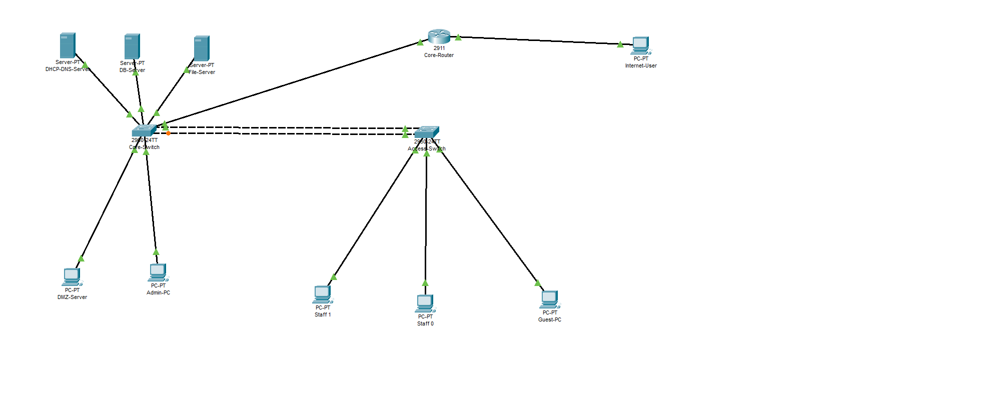
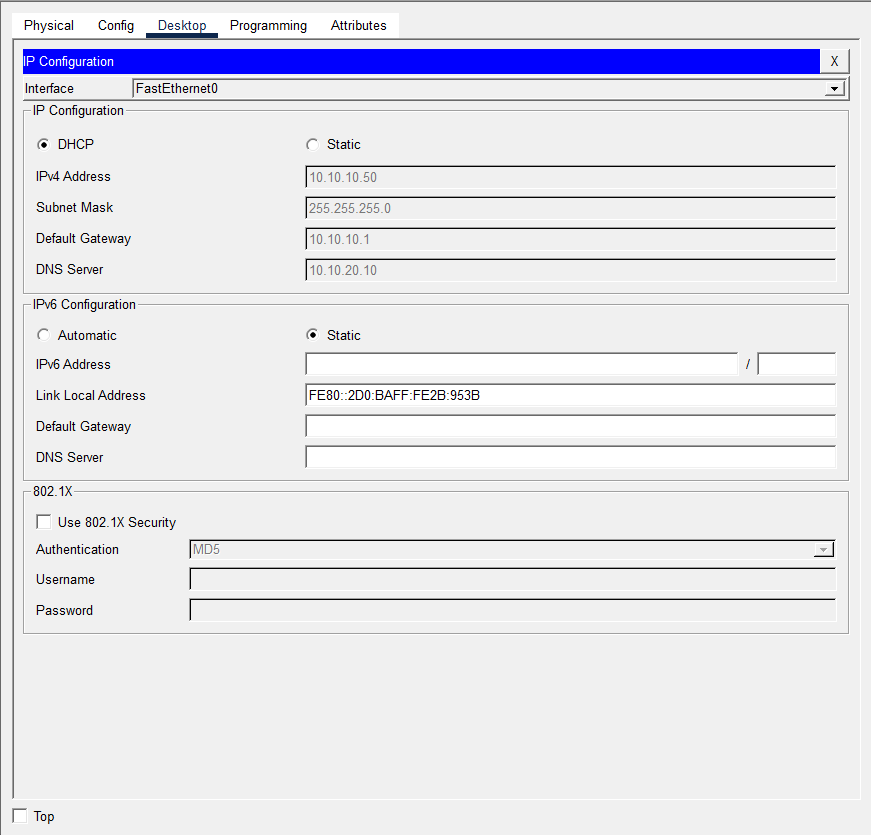
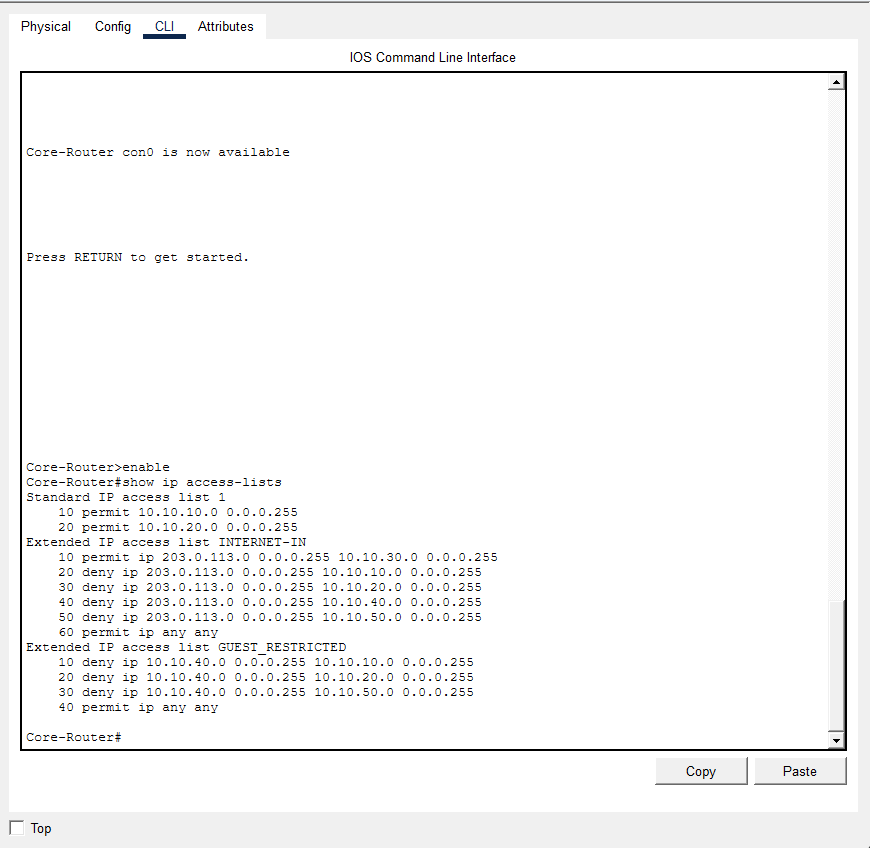
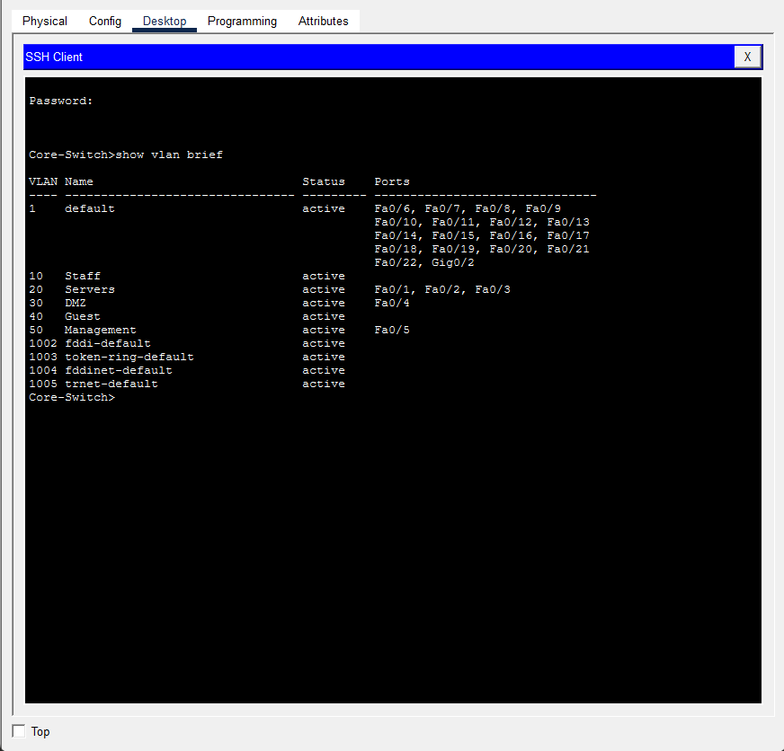
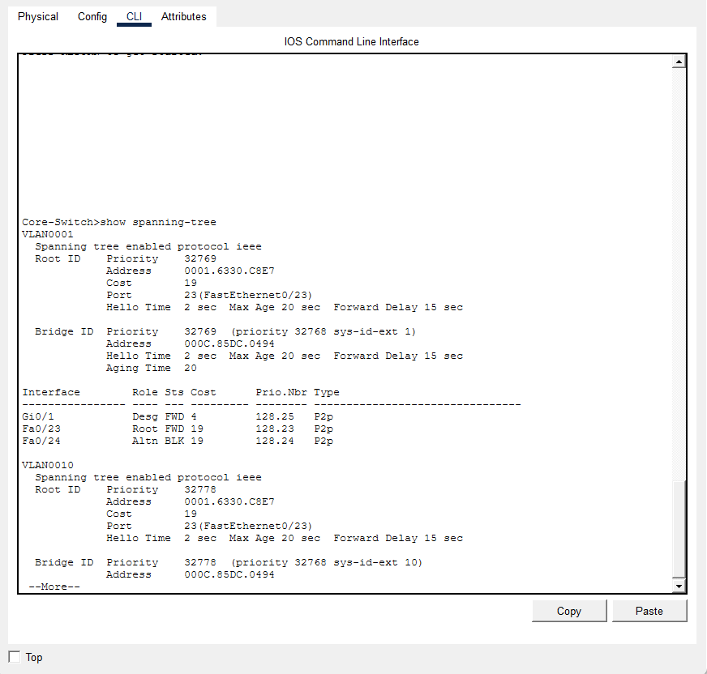

# TrinTech Solutions — Network Infrastructure Project
 
> Designed and implemented by Lee La Hee
 
---
 
## 📋 Project Overview
 
TrinTech Solutions is a small business migrating from paper-based operations to a fully digital environment. This project covers the complete design and implementation of their network infrastructure which includes on-premises network segmentation, access control, remote management, and a cloud-ready architecture that mirrors AWS VPC design principles.
 
This was built entirely from scratch in Cisco Packet Tracer using real Cisco IOS CLI commands sourced directly from Cisco documentation.
 
---
 
## 🏢 Business Requirements
 
- Separate staff, server, guest, DMZ, and management traffic
- Protect internal servers from internet and guest access
- Allow staff to access file and database servers
- Give guests internet-only access
- Provide a DMZ for public-facing services
- Enable IT to manage all devices remotely without physical access
- Automatically assign IP addresses to staff and guest devices
- Ensure network resilience with redundant switching
---
 
## 🗺️ Network Topology
 

 
---
 
## 📐 VLAN Design
 
| VLAN | Name | Purpose | Subnet | Gateway |
|---|---|---|---|---|
| 10 | Staff | Employee devices | 10.10.10.0/24 | 10.10.10.1 |
| 20 | Servers | Internal servers | 10.10.20.0/24 | 10.10.20.1 |
| 30 | DMZ | Public-facing server | 10.10.30.0/24 | 10.10.30.1 |
| 40 | Guest | Visitor devices | 10.10.40.0/24 | 10.10.40.1 |
| 50 | Management | IT admin access only | 10.10.50.0/24 | 10.10.50.1 |
 
---
 
## 🖥️ Full IP Addressing Scheme
 
| Device | IP Address | VLAN | Assignment |
|---|---|---|---|
| Core-Router Gi0/0.10 | 10.10.10.1 | 10 | Static |
| Core-Router Gi0/0.20 | 10.10.20.1 | 20 | Static |
| Core-Router Gi0/0.30 | 10.10.30.1 | 30 | Static |
| Core-Router Gi0/0.40 | 10.10.40.1 | 40 | Static |
| Core-Router Gi0/0.50 | 10.10.50.1 | 50 | Static |
| Core-Router Gi0/1 | 203.0.113.1 | WAN | Static |
| Core-Switch SVI | 10.10.50.2 | 50 | Static |
| Access-Switch SVI | 10.10.50.3 | 50 | Static |
| DHCP-DNS-Server | 10.10.20.10 | 20 | Static |
| DB-Server | 10.10.20.11 | 20 | Static |
| File-Server | 10.10.20.12 | 20 | Static |
| DMZ-Server | 10.10.30.10 | 30 | Static |
| Admin-PC | 10.10.50.10 | 50 | Static |
| Internet-User | 203.0.113.10 | WAN | Static |
| Staff-PC1 | 10.10.10.50+ | 10 | DHCP |
| Staff-PC2 | 10.10.10.51+ | 10 | DHCP |
| Guest-PC | 10.10.40.50+ | 40 | DHCP |
 
---
 
## ⚙️ Technologies and Features Implemented
 
**Switching**
- VLAN creation and access port assignment on both switches
- 802.1Q trunking carrying all VLANs across inter-switch and switch-to-router links
- Redundant links between Core-Switch and Access-Switch
- Spanning Tree Protocol (STP) automatically managing redundant paths
- Management SVIs on both switches for remote access
**Routing**
- Router on a Stick — single physical interface with five subinterfaces
- 802.1Q encapsulation per subinterface for inter-VLAN routing
- Each subinterface acts as the default gateway for its VLAN
**DHCP and DNS**
- DHCP server hosted on VLAN 20 serving VLAN 10 (Staff) and VLAN 40 (Guest)
- DHCP relay (ip helper-address) configured on router subinterfaces to forward broadcasts across VLANs
- Separate pools per VLAN with correct gateways and DNS assignments
- Internal DNS server resolving hostnames for staff devices
- Guest devices pointed to public DNS (8.8.8.8) — no internal hostname resolution
**Security**
- Named extended ACLs enforcing security policy
- INTERNET-IN ACL — permits internet access to DMZ only, blocks all internal subnets
- GUEST-RESTRICT ACL — blocks guest traffic from staff, server, and management VLANs
- Management VLAN completely isolated from internet and general users
- NAT overload (PAT) — staff and server subnets can initiate outbound internet connections while remaining unreachable inbound
**Remote Management**
- SSH v2 configured on Core-Router, Core-Switch, and Access-Switch
- RSA key generation, local user authentication, VTY line hardening
- Telnet disabled — SSH only
- All devices manageable from Admin-PC without physical access
---
 
## 🔒 Security Policy
 
| Source | Destination | Action | Reason |
|---|---|---|---|
| Internet | DMZ | ✅ Allow | Public-facing services must be reachable |
| Internet | Staff | ❌ Deny | Internal network must be private |
| Internet | Servers | ❌ Deny | Servers must not be internet-facing |
| Internet | Guest | ❌ Deny | Guest subnet not publicly reachable |
| Internet | Management | ❌ Deny | Management must never be exposed |
| Guest | Staff | ❌ Deny | Guests cannot see staff resources |
| Guest | Servers | ❌ Deny | Guests cannot access internal servers |
| Guest | Management | ❌ Deny | Guests cannot reach network equipment |
| Staff | Servers | ✅ Allow | Staff need file and database access |
| Admin | Everything | ✅ Allow | IT requires unrestricted access |
 
---
 
## ☁️ AWS Architecture Mapping
 
This project was designed to mirror real AWS VPC architecture. Every component has a direct cloud equivalent:
 
| Packet Tracer Component | AWS Equivalent |
|---|---|
| Core-Router subinterfaces | VPC implicit router + route tables |
| Gi0/1 internet interface | Internet Gateway |
| VLAN 10 Staff | Private subnet |
| VLAN 30 DMZ | Public subnet |
| VLAN 20 Servers | Private subnet (no IGW route) |
| VLAN 50 Management | Private ops subnet |
| INTERNET-IN ACL | Security Groups + NACLs |
| NAT overload | NAT Gateway |
| DHCP server | AWS-managed VPC DHCP |
| SSH management | EC2 SSH key pair access |
 
---
 
## ✅ Test Results
 
### DHCP Verification
| Device | Expected Range | Result |
|---|---|---|
| Staff-PC1 | 10.10.10.50-150 | ✅ Pass |
| Staff-PC2 | 10.10.10.50-150 | ✅ Pass |
| Guest-PC | 10.10.40.50-100 | ✅ Pass |
 
### Security Tests — From Internet-User
| Target | Expected | Result |
|---|---|---|
| DMZ-Server (10.10.30.10) | ✅ Reachable | ✅ Pass |
| Staff-PC1 (10.10.10.x) | ❌ Blocked | ✅ Pass |
| DHCP-DNS-Server (10.10.20.10) | ❌ Blocked | ✅ Pass |
| Guest-PC (10.10.40.x) | ❌ Blocked | ✅ Pass |
| Admin-PC (10.10.50.10) | ❌ Blocked | ✅ Pass |
 
### Security Tests — From Guest-PC
| Target | Expected | Result |
|---|---|---|
| DMZ-Server (10.10.30.10) | ✅ Reachable | ✅ Pass |
| Staff-PC1 | ❌ Blocked | ✅ Pass |
| DB-Server (10.10.20.11) | ❌ Blocked | ✅ Pass |
| Admin-PC (10.10.50.10) | ❌ Blocked | ✅ Pass |
 
### Connectivity Tests — From Staff-PC1
| Target | Expected | Result |
|---|---|---|
| File-Server (10.10.20.12) | ✅ Reachable | ✅ Pass |
| DB-Server (10.10.20.11) | ✅ Reachable | ✅ Pass |
| DMZ-Server (10.10.30.10) | ✅ Reachable | ✅ Pass |
 
### SSH Tests — From Admin-PC
| Target | Result |
|---|---|
| Core-Switch (10.10.50.2) | ✅ Pass |
| Access-Switch (10.10.50.3) | ✅ Pass |
| Core-Router (10.10.50.1) | ✅ Pass |
 
---
 
## 📸 Screenshots
 
| Description | Screenshot |
|---|---|
| Network Topology |  |
| DHCP Assignment |  |
| ACL Hit Counts |  |
| SSH Session |  |
| STP Blocking Port |  |
 
---
 
## 📁 Repository Structure
 
```
Network-Infrastructure/
├── README.md
├── TrinTech Network.pkt        ← Cisco Packet Tracer file
├── DHCP-Assignment.png
├── SSH.png
├── Spanning-Tree.png
├── ACLs.png
├── Trintech-Simulated-Network.png
    
```
 
---
 
## 💡 What I Learned
 
This project gave me hands-on experience with the full lifecycle of designing and implementing a network from business requirements to working infrastructure. The most valuable lessons were understanding why decisions are made and not just how to execute commands. Designing the security policy before writing ACL rules, planning the IP scheme before configuring anything, and troubleshooting failures methodically by checking each layer in order are habits this project built in me that no classroom exercise could replicate.
 
---
 
*Built by Lee La Hee — github.com/walestar*
